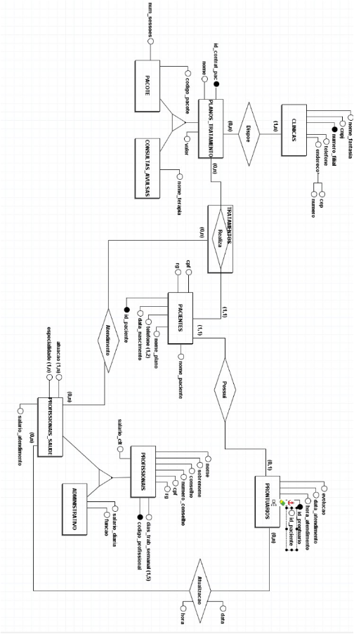
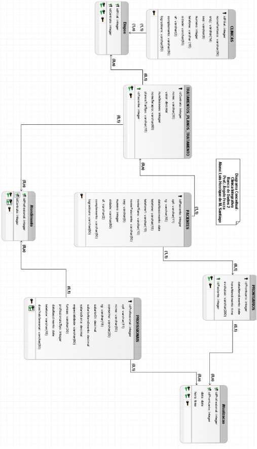
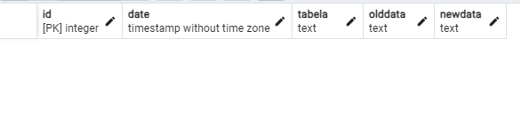
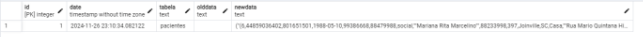
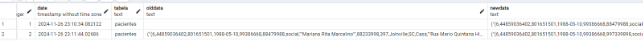
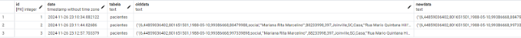

Atividade a Distância – Estudos de caso para o projeto conceitual Disciplina: Banco de dados II

Professor: Ângelo Augusto Frozza

Aluno: Luis Henrique de Melo Santiago

(a) Estudo de caso – Clínica de Fisioterapia

A Clínica Integrativa possui nome, CNPJ, telefone, endereço (CEP e número) e quer abrir filiais no futuro, então cada uma tem um número.

A  clínica  dispõe  de  vários  planos  de  tratamento  e  consultas  avulsas. Os planos de tratamento possuem código (identificador), nome, valor e número de sessões em caso de pacote.

Ela conta com vários profissionais, cada um com sua especialidade, nem todos trabalham todos os dias nessa clínica. Alguns profissionais como a secretária trabalham todos os dias, porém outros trabalham menos que 5 dias. O salário pode ser mensal por CLT ou por atendimento, sendo que, nesses últimos dois casos, o profissional recebe via PJ.

Os  profissionais  possuem  no  seu  cadastro  informações:  identificador  do profissional, nome completo, conselho do profissional (se for da área da saúde), CPF, RG, salário, modo de contratação (CLT ou PJ), especialidade, função e telefone. Cada profissional será cadastrado com a especialização na qual atuará na clínica. Além dos profissionais, a clínica conta com secretária, que possui salário e é CLT, e faxineira que recebe por diária.

Um profissional da saúde pode atender mais de um paciente por hora. Um paciente pode ser atendido por um a três profissionais da saúde durante e a contratação do plano, conforme o tipo de plano. 

Após os atendimentos, os profissionais devem evoluir o prontuário dos pacientes. Esse prontuário deve conter o id do paciente e do prontuário, registro do atendimento (evolução), data e hora dos atendimentos. A atualização não precisa ser no mesmo dia, mas ao ser feita, registrar data e hora. Somente os profissionais da saúde têm acesso aos prontuários, garantindo a confidencialidade dos dados dos pacientes.

Pacientes ao serem registrados possuem nome, CPF, RG, identificador do paciente, data de nascimento, telefone (um ou dois) e nome do plano contratado.

O  paciente  não  tem  acesso  direto  ao  prontuário,  mas  pode  solicitar  aos profissionais uma relação das evoluções escritas no prontuário.

As especialidades dos profissionais se referem às áreas que atendem, já que eles atendem podem ter estudado várias áreas de conhecimento, mas se especializaram e atuam somente em uma na clínica contratada.

Deve ser possível emitir relatórios como: 

- Listar um profissional em específico, os pacientes atendidos por ele e a data e 

hora dos atendimentos realizados. 

- Mostrar o nome dos pacientes com CPF, plano de tratamento e valor pago no 

plano em ordem decrescente.

- Mostrar todos os planos contratados por uma filial selecionada, junto com os 

dados do plano.

- Mostrar as evoluções e profissionais que atenderam um paciente quando se 

insere o CPF dele.

- Mostrar os profissionais, evoluções feitas por ele e pacientes atendido quando é 

inserida uma data específica.

2) Diagrama conceitual (Criado com brModelo 3):

Diagrama lógico (Criado com brModelo 3):

3) Projeto Físico: DDL e DML
- DLL do banco de dados Clinica Integrativa Criação do banco de dados clinica\_integrativa:

  CREATE DATABASE clinica\_integrativa; 

- Criação de Domínios para dados mais comuns:

CREATE DOMAIN cidadeDomain AS VARCHAR(50);

CREATE DOMAIN complementoDomain AS VARCHAR(50); CREATE DOMAIN cepDomain AS VARCHAR(8) CHECK (LENGTH Validação para que seja apenas 8 dígitos

|(VALU|E)||
| - | - | :- |
||||
= 8); --

CREATE DOMAIN telDomain AS VARCHAR(15);

CREATE DOMAIN cpfDomain AS VARCHAR(11);

CREATE DOMAIN rgDomain as VARCHAR(15);

CREATE DOMAIN ufDomain as VARCHAR(2);

CREATE DOMAIN logradouroDomain as VARCHAR(50);

- Tabelas primárias

CREATE TABLE clinicas (

`  `idFilial SERIAL PRIMARY KEY,

`  `nomeFantasia VARCHAR(50) NOT NULL,

`  `cnpj VARCHAR(14) NOT NULL,

`  `cep cepDomain NOT NULL,

`  `numero INTEGER NOT NULL,

`  `telefone telDomain NOT NULL,

`  `cidade cidadeDomain NOT NULL,

`  `uf ufDomain NOT NULL,

`  `complemento complementoDomain NOT NULL,   logradouro logradouroDomain NOT NULL

);

--As clínicas terão pequena diferença nos nomes, CNPJ pode alterar também, temos o telefone e o numero do endereço.

CREATE TABLE pacientes (

`  `idPaciente SERIAL PRIMARY KEY,

`  `cpf cpfDomain NOT NULL UNIQUE,-- A adição de unique para que não haja repetição de cpf por engano.

`  `rg rgDomain NOT NULL,

`  `dataNasc DATE NOT NULL,

`  `telefone telDomain NOT NULL,

`  `telefone1 telDomain, --Não obrigatório

`  `nomePlano VARCHAR(10) NOT NULL,

`  `nomePaciente VARCHAR(50) NOT NULL,

`  `cep cepDomain NOT NULL,

`  `numero INTEGER NOT NULL,

`  `cidade cidadeDomain NOT NULL,

`  `uf ufDomain NOT NULL,

`  `complemento complementoDomain NOT NULL,   logradouro logradouroDomain NOT NULL

);

--Pacientes podem ter até dois telefones

CREATE TABLE profissionais (

`  `idProfissional SERIAL PRIMARY KEY,

`  `cpf cpfDomain NOT NULL UNIQUE,

`  `nome VARCHAR(50) NOT NULL,

`  `conselho VARCHAR(20),

`  `rg rgDomain NOT NULL,

`  `salarioClt DECIMAL(15,2),

`  `salarioAtendimento DECIMAL(15,2),

`  `salarioDiaria DECIMAL(15,2),

`  `especialidade VARCHAR(50) NOT NULL,   funcao VARCHAR(30) NOT NULL, 

`  `profissionaisTipo INTEGER NOT NULL ser apenas 0 ou 1.

|` `CHEC|K (profissionaisTipo|` `I|N |(|0,||1)),|` `--Forçar|
| - | - | - | - | - | - | :- | - | - |
||||||||||
`  `dataNasc DATE NOT NULL,

`  `telefone telDomain NOT NULL,

`  `diasTrabSemanal VARCHAR(50) NOT NULL

);

-- Os profissionais da saúde conselho (numero e nome), mas caso a função seja administrativa não terá. Os profissionais da saúde também possuem atuação (as especialidades que executa na clínica) e especialidade(s) da área.

-- profissionaisTipo = 0 são da parte administrativa/secretaria e profissionaisTipo = 1 são da área da saúde. O número do conselho está em varchar devido ter uma letra ao final. -- função diz respeito a formação base ou atuação base. Ex.: fisioterapeuta, secretário, faxineira, etc.

-- Tabelas secundárias

CREATE TABLE trat\_planos\_trat (

`  `idContrato SERIAL PRIMARY KEY,

`  `nome VARCHAR(30) NOT NULL,

`  `valor DECIMAL(7,2) NOT NULL,

`  `numSessoes INTEGER NOT NULL,

`  `nomeTerapia VARCHAR (60) NOT NULL,

`  `planosTratTipo VARCHAR(15) NOT NULL,

`  `idPaciente INTEGER NOT NULL,

`  `FOREIGN KEY(idPaciente) REFERENCES pacientes (idPaciente) );

--idContrato = id de contratação do pacote.

CREATE TABLE prontuarios (

`  `idProntuario SERIAL PRIMARY KEY,   dataAtendimento DATE NOT NULL,

`  `horaAtendimento TIME NOT NULL,

`  `evolucao VARCHAR(200) NOT NULL,   idPaciente INTEGER NOT NULL,

|Y(idPaciente)|` `REFERENCE|S pacientes (idPaciente|
| - | - | - |

);

--Tabelas terciárias

CREATE TABLE dispoe (

`  `idFilial INTEGER NOT NULL,

`  `idContrato INTEGER NOT NULL,

`  `PRIMARY KEY (idFilial, idContrato),

`  `FOREIGN KEY(idFilial) REFERENCES clinicas (idFilial),

`  `FOREIGN KEY (idContrato) REFERENCES trat\_planos\_trat (idContrato) );

CREATE TABLE atendimento (

`  `idContrato INTEGER NOT NULL,

`  `idProfissional INTEGER NOT NULL,

`  `PRIMARY KEY (idContrato, idProfissional),

`  `FOREIGN KEY (idContrato) REFERENCES trat\_planos\_trat (idContrato),

`  `FOREIGN KEY(idProfissional) REFERENCES profissionais (idProfissional) );

CREATE TABLE atualizacao (

`  `idProfissional INTEGER NOT NULL,

`  `idProntuario INTEGER NOT NULL,

`  `data DATE NOT NULL,

`  `hora TIME NOT NULL,

`  `PRIMARY KEY (idProfissional, idProntuario),

`  `FOREIGN KEY(idProfissional) REFERENCES profissionais (idProfissional),   FOREIGN KEY(idProntuario) REFERENCES prontuarios (idProntuario)

);

- DML do banco de dados Clínica Integrativa
- Inclusão de 5 registros para cada tabela;

INSERT INTO clinicas (nomeFantasia, cnpj, cep, numero, telefone, cidade, uf, complemento, logradouro)

|` `VALUE|S |('Clinica Integrativa Balneario|',|` `'82161803697100|',|` `'88330081|',|` `12|3,|` `'33672030'|
| - | - | - | - | - | - | - | - | - | - | - |

'Balneario Camboriu', 'SC', 'Casa', 'Rua Uganda'),

|||||('Clinica Integrativa Camboriu|',|` `'82161103697100|',|` `'88345022|',|` `45|6,|` `'30652210'|
| :- | :- | :- | :- | - | - | - | - | - | - | - | - | - |

'Camboriu', 'SC', 'Casa', 'Rua Areias'),

||('Clinica Integrativa Itajai|',|` `'82161855697100|',|` `'88319445|',|` `78|9,|` `'33413020|',|` `'Itajai'|
| :- | - | - | - | - | - | - | - | - | - | - | - |

'SC', 'Casa', 'Rua Araquari'),

||('Clinica Integrativa Joinville|',|` `'82134803697100|',|` `'89230747|',|` `12|1,|` `'34311150'|
| :- | - | - | - | - | - | - | - | - | - |

, , 

'Joinville', 'SC', 'Escritório', 'Rua das Armas'),

|||||('Clinica Integrativa Curitiba|',|` `'82166503697100|',|` `'82974086|',|` `32|1,|` `'33503170'|
| :- | :- | :- | :- | - | - | - | - | - | - | - | - | - |

'Curitiba', 'PR', 'Escritório', 'Av. Rebolsas');

INSERT INTO pacientes (cpf, rg, dataNasc, telefone, telefone1, nomePlano, nomePaciente, cep, numero, cidade, uf, complemento, logradouro)

`  `VALUES ('97055631179', '548702055', '1985-04-12', '83749261', '99283716', 'vip','Ana Clara Rodrigues', '88924560', 332, 'Balneario Camboriu', 'SC', 'Casa 2', 'Quarta Avenida'),          ('51923874623', '886106896', '1993-07-29', '88839416', '96172934', 'gold','João Pedro Silva', '88933439', 121, 'Camboriu', 'SC', 'apto 703', 'Avenida Santo Amaro'),

|||||('63597180204|',|` `'774304866', '2001-11-08|',|` `'88462719|',|` `'97582936|',|` `'social','Mari|
| :- | :- | :- | :- | - | - | - | - | - | - | - | - | - |

Eduarda Almeida', '88213809', 122, 'Caboriú', 'SC', 'apto 1001', 'Rua Santa Clara'),

|||||('72486310985|',|` `'970072986', '1978-03-25', '99283746|',|` `'96473829|',|` `'vip'|,'Luca|
| :- | :- | :- | :- | - | - | - | - | - | - | - | - |

Oliveira Santos', '88391080', 989, 'Joinville', 'SC', 'Casa de fundos', 'Rua Joaquim Lacerda'),

`         `('18759034602', '901652701', '1966-10-17', '99384765', '88475612', 'social','Beatriz Costa Pereira', '88233070', 1287, 'Sao Jose do Pinhais', 'PR', 'Casa', 'Rua Julio Pereira Sobrinho');

INSERT INTO profissionais (cpf, nome, conselho, rg, salarioClt, salarioAtendimento, salarioDiaria, especialidade, funcao, profissionaisTipo, dataNasc, telefone, diasTrabSemanal)

|` `VALUE|S |('97055721179|',|` `'João Pereira da Silva|',|` `'CREFITO10-123456F|',|` `'1255567'|
| - | - | - | - | - | - | - | - | - |

4000\.00, NULL, NULL, 'Fisioterapeuta Ortopedica', 'Fisioterapeuta', 1, '1990-02-01', 999887766, 'Segunda a sexta'),

||||('51923124623|',|` `'Maria Claudia dos Santos|',|` `'CRP12-654321P|',|` `'9876543|',|
| :- | :- | :- | - | - | - | - | - | - | - | - |

NULL, NULL, 'Psicologia Clinica', 'Psicóloga', 1,'1991-04-06', 999886677, 'Segunda e quarta'), 

`         `('63597340204', 'José Carlos Oliveira', 'CREF3-789012EF', '9871234', NULL, NULL, 150.00, 'Instrutor de Pilates', 'Educador Fisico', 1,'1988-09-15', 999567803, 'Segunda a sexta'), 

`         `('72486560985', 'Ana Carolina Pereira', 'CREFITO10-345678F', '1287654', NULL, 180.00, NULL, 'Osteopatia', 'Fisioterapeuta', 1, '1987-08-11', 991857761, 'Quinta e sábado'), 

`         `('18759784602', 'Carlos Fernando Rodrigues', NULL, '6543219', 2200.00, NULL,  NULL, 'Organizacao de agenda e relatorios de rendimentos', 'Secretario', 0,'1990-02-01', 999887766, 'Segunda a sexta'), 

|||||('18999904602|',|` `'Maria Fernanda Cordeiro|',|` `NUL|L,|` `'6577187|',|` `NUL|L,|` `NUL|L,|` `220|
| :- | :- | :- | :- | - | - | - | - | - | - | - | - | - | - | - | - | - |

.00, 

'Limpeza e fazer comida', 'Faxineira', 0,'1980-10-20', 992867526, 'Sabado'); --Somente profissionais da saúde tem conselho

--Profissional 1 é da saúde e 0 é administrativo

INSERT INTO trat\_planos\_trat (nome, valor, numSessoes, nomeTerapia, planosTratTipo, idPaciente)

`  `VALUES ('vip', 2000, 10, 'Fisioterapia, Pilates e Psicologia', 'pacote', 1),

`         `('gold', 1500, 8, 'Fisioterapia e Pilates', 'pacote', 2),

`         `('social', 1000, 10, 'Fisioterapia', 'pacote', 3),

`         `('vip', 2000, 10, 'Fisioterapia, Pilates e Psicologia', 'pacote', 4),

`         `('social', 1000, 10, 'Fisioterapia', 'pacote', 5),

`         `('particular', 180, 1, 'Osteopatia', 'particular', 2);

--CPF presente é do paciente que está complanto o plano ou particular. 

INSERT INTO prontuarios (dataAtendimento, horaAtendimento, evolucao, idPaciente)   VALUES ('2024-11-20', '08:31:42', 'A paciente apresentou melhora significativa das dores.', 1),

`         `('2024-10-12', '10:42:30', 'O paciente relatou aumento da dor nos membros inferiores após última intervenção.', 2),

|||('2024-11-26|',|` `'14:11:10|',|` `'Paciente disse que a dor não retornou. Paciente está d|
| :- | :- | - | - | - | - | - |

alta.', 3),

|||('2024-10-27|',|` `'09:02:41|',|` `'Paciente disse que a dor está 80% melhor. Ser|
| :- | :- | - | - | - | - | - |

necessário realizar um novo plano de tratamento.', 4),

`         `('2024-12-03', '08:01:25', 'Houve redução de irradiação para membro inferior direito.', 5),

`         `('2024-11-03', '11:37:55', 'Houve redução da dor nos ombros. Foi feita mobilização articular e alongamento muscular na região da cervical e membros superiores.', 2);

INSERT INTO dispoe (idFilial, idContrato) VALUES (1, 1),

`       `(2, 2),

`       `(3, 3),

`       `(4, 5),

`       `(5, 4),

`       `(1, 6);

INSERT INTO atendimento (idProfissional, idContrato) VALUES (1, 1), 

`       `(2, 1),

`       `(3, 1),

`       `(1, 2),

(3, 2), (1, 3), (1, 4), (2, 4),

(3, 4), (1, 5), (4, 6);

INSERT INTO atualizacao (idProfissional, idProntuario, data, hora) VALUES (2, 1, '2024-06-24', '08:44:17'),

`       `(1, 2, '2024-06-25', '10:49:10'),

`       `(1, 3, '2024-04-30', '14:14:33'),

`       `(3, 4, '2024-06-01', '09:01:55'),

`       `(1, 5, '2024-06-04', '10:36:03'),

`       `(4, 6, '2024-06-04', '10:37:12');

-- data remete a data que foi feita a última atualização, já que o profissional pode atualizar 

- prontuário após o atendimento.
4) Scripts SQL para consultas, algumas usando diferentes tipos de JOIN
1) Selecionar pacientes (nomes), cpf, plano de tratamento, valor pago no plano em ordem decrescente.

   SELECT 

   `    `p.nomePaciente,

   `    `p.cpf,

   `    `tpt.nome AS plano\_de\_tratamento,     tpt.valor

   FROM 

   `    `pacientes p

   JOIN 

||`  `trat\_planos\_trat tpt|` `ON p.idPaciente||= tpt.idPacient|
| :- | - | - | :- | - |

ORDER BY  valor DESC;

2) Selecionar profissional 'João Pereira', atendimentos (nome dos pacientes) e as datas com horas das atualizações nos prontuários.

   SELECT 

   `    `p.nome AS nome\_profissional,

   `    `pa.nomePaciente AS nomePaciente,     atz.data,

   `    `atz.hora

   FROM 

   `    `profissionais p

   INNER JOIN 

||`  `atualizacao atz|` `O|N p.idProfissional||= atz.idProfissiona|
| :- | - | - | - | :- | - |

l o

INNER JOIN 

||`  `prontuarios pro|` `O|N atz.idProntuario||= pro.idProntuari|
| :- | - | - | - | :- | - |

INNER JOIN 

||`  `pacientes pa|` `O|N pro.idPaciente||= pa.idPacient|
| :- | - | - | - | :- | - |

WHERE 

`    `p.nome LIKE '%João Pereira%';

3) Mostrar todos os planos contratados (com seus dados) da filial 1 da clínica.

SELECT 

`    `c.idFilial,

`    `c.nomeFantasia AS nome\_da\_clinica,     tpt.\*

FROM 

`    `clinicas c

LEFT JOIN 

||`  `dispoe d|` `O|N c.idFilial||= d.idFilia|
| :- | - | - | - | :- | - |

LEFT JOIN 

||`  `trat\_planos\_trat tpt|` `O|N d.idContrato||= tpt.idContrat|
| :- | - | - | - | :- | - |

WHERE 

`    `c.idFilial = 1;

4) Mostrar  as  evoluções  e  profissionais  que  atenderam  a  paciente  com  cpf “51923874623”.

   SELECT 

   `    `pro.nome AS nome\_profissional,     p.evolucao AS evolucao,

   `    `pa.nomePaciente AS nomePaciente,     pa.cpf AS cpf

   FROM 

   `    `pacientes pa

   INNER JOIN 

||`  `prontuarios p|` `O|N pa.idPaciente||= p.idPacient|
| :- | - | - | - | :- | - |

INNER JOIN  ![ref1]

`    `atualizacao at INNER JOIN 

|` `O|N p.idProntuario||= at.idProntuari|
| - | - | :- | - |
|||||
||`  `profissionais pro|` `O|N at.idProfissional||= pro.idProfissiona|
| :- | - | - | - | :- | - |

WHERE 

`    `pa.cpf = '51923874623';

5) Mostrar profissionais, evoluções e pacientes atendidos no dia 2024-11-03.

SELECT 

`    `pro.nome AS nome\_profissional,

`    `p.evolucao AS evolucao,

`    `pa.nomePaciente AS nomePaciente,

`    `p.dataAtendimento AS dataAtendimento FROM 

`    `profissionais pro

RIGHT JOIN  

`    `atualizacao at

|` `O|N pro.idProfissional||= at.idProfissiona|
| - | - | :- | - |
|||||
RIGHT JOIN 

||`  `prontuarios p|` `O|N at.idProntuario||= p.idProntuari|
| :- | - | - | - | :- | - |

RIGHT JOIN 

||`  `pacientes pa|` `O|N p.idPaciente||= pa.idPacient|
| :- | - | - | - | :- | - |

WHERE 

`    `p.dataAtendimento = '2024-11-03';

5) Scripts SQL para Stored Procedures (incluir comentário explicando para que serve aSP e os parâmetros, caso utilizar).
- Stored Procedure para inserir um novo paciente na tabela ‘pacientes’.
- Parâmetros: a\_cpf (cpf do paciente), a\_rg (rg do paciente), a\_dataNasc (data de nascimento do paciente), a\_telefone (telefone do paciente), a\_telefone1 (segundo telefone do paciente), a\_nomePlano (plano que o paciente está cadastrado), a\_nomePaciente, a\_cep (cep do paciente), a\_número (número residencial do paciente), a\_cidade (cidade em  que  o  paciente  mora),  a\_uf  (unidade  federativa  em  que  o  paciente  mora), a\_complemento (complemento do endereço do paciente), a\_logradouro (logradouro do endereço do paciente).

CREATE OR REPLACE FUNCTION 

|`  `sp\_inserirPaciente (a\_cpf|` `VARCHAR|
| - | - |
||1), a\_rg|` `VARCHA|
| :- | - | - |
||||
||5), a\_dataNasc|` `DAT|
| :- | - | - |
||||
a\_telefone VARCHAR(15), 

`                      `a\_telefone1 VARCHAR VARCHAR(50), 

|(1|5), a\_nomePlano|` `VARCHAR|
| - | - | - |

(10), a\_nomePaciente 

`                      `a\_cep VARCHAR VARCHAR(2),  

|(|8), a\_numero|` `INTEGE|R, a\_cidade|` `VARCHA|
| - | - | - | - | - |
||||||
R(50), a\_uf 

`                      `a\_complemento VARCHAR   RETURNS void as $$

|(5|0), a\_logradouro|` `VARCHA|
| - | - | - |
||||
R(50))

`  `BEGIN              

`      `INSERT INTO pacientes (cpf, rg, dataNasc, telefone, telefone1, nomePlano, nomePaciente, 

`                            `cep, numero, cidade, uf, complemento, logradouro)

`      `VALUES (a\_cpf, a\_rg, a\_dataNasc, a\_telefone, a\_telefone1, a\_nomePlano, a\_nomePaciente, 

`              `a\_cep, a\_numero, a\_cidade, a\_uf, a\_complemento, a\_logradouro);

`  `END

`  `$$ LANGUAGE 'plpgsql';

-- ID paciente não adicionado pois ele é SERIAL.

- Stored Procedure para atualizar os salários dos funcionários.
- Parâmetros: a\_idProfissional (id do profissional), a\_novoSalarioCLT (valor a ser recebido para modificar o salário CLT), a\_novoSalarioDiaria (valor a ser recebido para modificar o salário diária), a\_novoSalarioAtendimento (valor a ser recebido para modificar 
- salário atendimento).

CREATE OR REPLACE FUNCTION  

`  `sp\_atualizarSalario (a\_idProfissional INT, a\_novoSalarioCLT DECIMAL(15,2),                     a\_novoSalarioDiaria DECIMAL(15,2), a\_novoSalarioAtendimento DECIMAL(15,2))

`  `RETURNS void as $$

`  `BEGIN

`      `UPDATE profissionais

`      `SET 

`        `salarioClt = CASE 

`          `WHEN a\_novoSalarioCLT > 0

|` `THE|N a\_novoSalarioCL|
| - | - |
|||
`          `ELSE salarioClt

`        `END,      

`        `salarioDiaria = CASE 

`          `WHEN a\_novoSalarioDiaria > 0

|` `THE|N a\_novoSalarioDiari|
| - | - |
|||
`          `ELSE salarioDiaria

`        `END,  

`        `salarioAtendimento = CASE 

`          `WHEN a\_novoSalarioAtendimento > 0           ELSE salarioAtendimento

|` `THE|N a\_novoSalarioAtendiment|
| - | - |
|||
`        `END

`      `WHERE idProfissional = a\_idProfissional;   END![ref2]

|`  `$$|` `LANGUAG|
| - | - |
|||
E 'plpgsql';

6) Scripts SQL para Functions (incluir comentário explicando para que serve a Function e os parâmetros de entrada e valor de saída).
- Function para calcular Número de contratos de planos feitos. Será ordenado em ordem decrescente.
- Parâmetro: nomePlano receberá na tabela o nome dos planos, totalContratos receberá a soma dos números de planos feitos.
- Retorna: Uma tabela com o nome e número de atendimentos de cada plano.
- OBS: A função está sem parâmetros de entrada, pois foi projetada para executar uma operação fixa e independente.

  CREATE OR REPLACE FUNCTION 

  `  `f\_totalContratos() 

  `  `RETURNS TABLE (nomePlano VARCHAR   BEGIN

|(3|0), totalContratos|` `BIGIN|T)|` `A|S $|
| - | - | - | - | - | - |
|||||||
`      `RETURN QUERY

`      `SELECT

`          `tpt.nome AS nomePlano,

`          `COUNT(\*) AS totalContratos

`      `FROM trat\_planos\_trat tpt

`      `GROUP BY tpt.nome

`      `ORDER BY totalContratos DESC;

`  `END;![ref2]

|`  `$$|` `LANGUAG|
| - | - |
|||
E 'plpgsql';

- Function para calcular a idade de um paciente com base no ID dele.
- Parâmetros: dataNascimento (Data de nascimento do paciente) e idPaciente (identificação do paciente).
- Retorna: Idade do paciente em anos.

CREATE OR REPLACE FUNCTION 

`  `f\_calcularIdade(a\_idPaciente INT) 

`  `RETURNS TABLE(nomePaciente VARCHAR   BEGIN

|(5|0), idadeAtual|` `NUMERI|C)|` `A|S $|
| - | - | - | - | - | - |
|||||||
`      `RETURN QUERY

`      `SELECT 

`        `p.nomePaciente, ![ref1]

`        `EXTRACT(YEAR

|` `FRO|M AGE (CURRENT\_DATE, p.dataNasc))|` `A|S idadeAtua|
| - | - | - | - |
|||||
`      `FROM pacientes p

`      `WHERE p.idPaciente = a\_idPaciente;   END;

|`  `$$|` `LANGUAG|
| - | - |
|||
E 'plpgsql';

7) Scripts SQL para Views (incluir comentário explicando para que serve a View).
- View para listar pacientes do plano vip, em ordem alfabética.

CREATE VIEW pacientesVip 

`  `AS SELECT  p.nomePaciente, tpt.nome AS planoNome   FROM pacientes p

`  `LEFT JOIN trat\_planos\_trat tpt

|` `O|N p.idPaciente = tpt.idPacient|
| - | - |

`  `WHERE tpt.nome = 'vip'

|` `ORDER B|Y p.nomePaciente|` `AS|
| - | - | - |
||||
- View para listar nome do paciente, data, hora de atendimento e profissional que o atendeu. Está organizado do mais recente para o mais antigo.

  CREATE VIEW pacienteAtend

  `  `AS SELECT p.nomePaciente, pr.dataAtendimento, pr.horaAtendimento, pro.nome   FROM pacientes p

  `  `LEFT JOIN prontuarios pr

|` `O|N p.idPaciente||= pr.idPacient|
| - | - | :- | - |

e

`  `LEFT JOIN atualizacao a

|` `O|N pr.idProntuario||= a.idProntuari|
| - | - | :- | - |

`  `LEFT JOIN profissionais pro

|` `O|N a.idProfissional||= pro.idProfissiona|
| - | - | :- | - |

`  `ORDER BY pr.dataAtendimento DESC;

8) Scripts SQL para Triggers (incluir comentário explicando para que serve a Trigger).
- Trigger para registrar alterações nos dados dos pacientes na tabela “log\_pacientes”.
- Inclui as informações antigas e novas.

Para construir e demonstrar a TRIGGER, foram feitos vários passos:

1) É necessário criar a tabela “log\_pacientes” para armazenar os logs dos dados.

CREATE TABLE log\_pacientes (   id SERIAL PRIMARY KEY,

|` `TIMESTAMP|` `DEFAUL|T CURRENT\_TIMESTAMP|
| - | - | - |

`  `tabela TEXT NOT NULL,

`  `oldData TEXT DEFAULT '',   newData TEXT DEFAULT '' );

Tabela log\_pacientes criada

2) Criação da Function Trigger que verifica qual operação está sendo feita no BD (inclusão, exclusão ou alteração) e procedendo a inclusão do registro na tabela de log\_pacientes de acordo com a operação que está sendo realizada.

   CREATE OR REPLACE FUNCTION   RETURNS trigger AS $regLog$

|` `ft\_log\_paciente|s (|
| - | - |
|||
`    `DECLARE 

`    `dadosAntigos TEXT;

`    `dadosNovos   TEXT;

`  `BEGIN

`    `IF (TG\_OP = 'INSERT') THEN

`      `dadosNovos := ROW(NEW);

`      `INSERT  INTO log\_pacientes(tabela, oldData, newData)

`        `VALUES (TG\_TABLE\_NAME, DEFAULT, dadosNovos);

`    `ELSEIF (TG\_OP = 'DELETE') THEN

`      `dadosAntigos := ROW(OLD);

`      `INSERT INTO log\_pacientes(tabela, oldData, newData)

`        `VALUES (TG\_TABLE\_NAME, dadosAntigos, DEFAULT);

`    `ELSEIF (TG\_OP = 'UPDATE') THEN

`      `dadosNovos := ROW(NEW);

`      `dadosAntigos := ROW(OLD);

`      `INSERT INTO log\_pacientes (tabela, oldData, newData)

`        `VALUES (TG\_TABLE\_NAME, dadosAntigos, dadosNovos);     END IF;

`    `RETURN NEW;

`  `END

|`  `$regLog$|` `LANGUAG|
| - | - |
|||
E 'plpgsql';

3) Criação a Trigger sobre a tabela pacientes para ser executada depois (AFTER) de uma operação de inclusão, alteração ou exclusão.

   CREATE TRIGGER logPacientes

   AFTER INSERT OR UPDATE OR DELETE                         ON pacientes

   `  `FOR EACH ROW EXECUTE FUNCTION                           ft\_log\_pacientes();

4) Fazer operações de INSERT, UPDATE e DELETE na tabela “pacientes” (testar se a trigger está funcionando). 
- A cada operação, consulte a tabela de log\_pacientes (SELECT \* FROM log\_pacientes;), para ver o que foi registrado pela Trigger.

  INSERT INTO pacientes (cpf, rg, dataNasc, telefone, telefone1, nomePlano, nomePaciente, cep, numero, cidade, uf, complemento, logradouro) 

  `  `VALUES('44859036402', '801651501', '1988-05-10', '99386668', '88479988', 'social','Mariana Rita Marcelino', '88233998', 397, 'Joinville', 'SC', 'Casa', 'Rua Mario Quintana Hill');

Tabela log após INSERT na tabela.

|UPDAT|E pacientes|` `SE|T telefone|1|='997339898'|
| - | - | - | - | - | - |
|` `WHER|E idPacient|e|=|
| - | - | - | - |
|||||
Tabela log após update na tabela. DELETE

|` `FRO|M pacientes|` `WHER|E idPacient|e|=|
| - | - | - | - | - | - |
|||||||
Tabela log após deletar o idPaciente=6

9) Definição de Usuários e permissões (incluir os comandos para implementação dessas regras).

   -- Criação do usuário administrador que será usado pelos profissionais da saúde. CREATE USER admin PASSWORD 'adm123456';

   -- Criação do usuário secretária

   CREATE USER secretaria PASSWORD '123456';

   -- Permissões para o administrador (acesso total a todas as tabelas) GRANT SELECT, INSERT, UPDATE, DELETE ON clinicas, pacientes, profissionais, trat\_planos\_trat, prontuarios, dispoe, atendimento, atualizacao, log\_pacientes TO admin;

   -- Permissões para o usuário secretária

   GRANT SELECT ON pacientes, profissionais, clinicas, dispoe,                 atendimento TO secretaria; 

   GRANT SELECT, INSERT, UPDATE, DELETE

|` `O|N pacientes|` `T|O secretaria|
| - | - | - | - |
|||||
-- Não dará permissão para o usuário 'secretaria' na tabela 'prontuarios'.

-- GRANT SELECT ON clinica\_integrativa.prontuarios TO 'secretaria'; -- NÃO EXECUTAR, A SECRETÁRIA NÃO DEVE TER ACESSO.

- Passos para realizar o DUMP do banco de dados:

"C:\Program Files\PostgreSQL\16\bin\pg\_dump.exe" -U postgres -d clinica\_integrativa > C:\Users\lhg93\clinica\_integrativa\_dump.sql

- Criar e inserir DUMP no novo Banco de dados:

CREATEDB -U postgres clinica\_integrativa1 <- para criar o BD novo

PSQL -U postgres clinica\_integrativa1 < C:\Users\lhg93\clinica\_integrativa\_dump.sql

Link da Pasta compartilhada com os arquivos: https://github.com/luishmsantiago/Trabalho- Final-BD2.git

[ref1]: Aspose.Words.8d75ee3c-1eaf-41c3-988d-b573765833f8.020.png
[ref2]: Aspose.Words.8d75ee3c-1eaf-41c3-988d-b573765833f8.030.png
